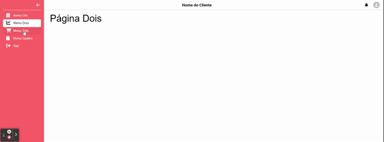

# Tela de Menu e conteúdo de sistema Desktop e mobile utilizando React com Next

Projeto utilizando o Next como um React Framework. Desenvolvido por um aprendiz de desenvolvimento.
Após o login veio o desafio de criar um Menu retrátil na versão mobile e desktop.

## Componentes

Utilizando a técnica de criar componentes e montar as páginas renderizando-os. Assim temos um código bem componentizado facilitando assim a manutenção e refatoração do código.

### UseEffect

Na tenteiva de fazer o menu marcar o item correspondente à página acessada eu precise usar o Hook do React chamado UseEffect. Eu não conseguia mudar a marcação do menu quando mudava a página. Após pesquisar bastante percebi que o React trabalha com o Server Side e assim as mudanças do lado do cliente não faziam efeito. Para permitir isso o UseEffect indica ao React que teremos mudanças após a renderização. Assim o REACT permite a mudança do DOM após a renderização. Dessa forma consegui passar ao sistema que após renderizar a página ele deveria marcar o Menu de acordo com a propriedade recebida pr aquela página.

# Bibliotecas

## MUI

Utilizamos o Material UI, MUI, para montar o layout. Aqui a autodefinição "MUI provides a robust, customizable, and accessible library of foundational and advanced components, enabling you to build your design system and develop React applications faster."

# Observações

Ainda preciso refatorar o código para deixá-lo mais limpo. Mas, como em todo o projeto que se preze, não tenho como fazer isso agora e fica para depois. ;)

# Configurações

- [Next](https://nextjs.org/docs/getting-started)
- [MUI](https://mui.com/pt/)

## Para formatação de código

Utilizo o Prettier, ESLint e Simple React. Alguns links que podem ajudar nessa configuração:

- [Prettier](https://prettier.io/)
- [ESLint](https://eslint.org/)
- [Simple-React-Snippets](https://marketplace.visualstudio.com/items?itemName=burkeholland.simple-react-snippets)

Alguns artigos que ajudam nessa configuração:

- [ESLint+Prettier](https://medium.com/cwi-software/eslint-prettier-a-dupla-perfeita-para-produtividade-e-padroniza%C3%A7%C3%A3o-de-c%C3%B3digo-6a7730cfa358)

- [Prettier-config](https://www.digitalocean.com/community/tutorials/how-to-format-code-with-prettier-in-visual-studio-code-pt)

## Como ficam as telas

